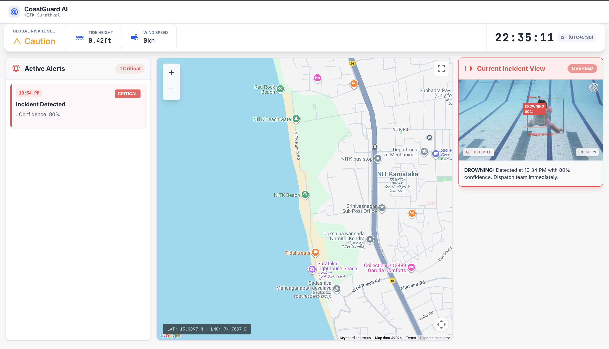
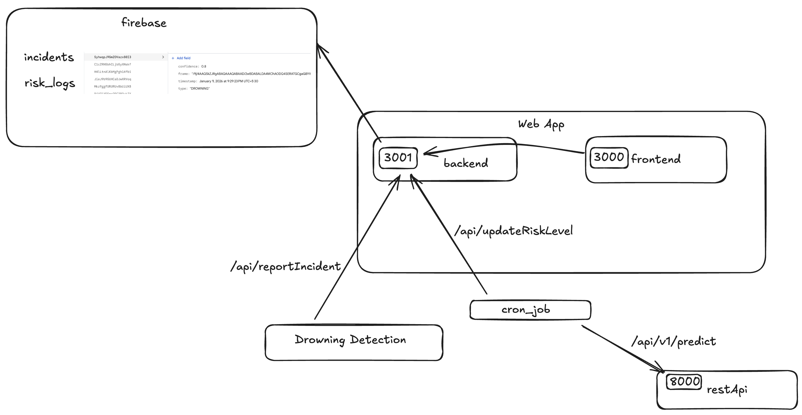

# CoastGuard AI


## Architecture


## Overview
Unified beach safety system with four pieces:
- `restapi/`: FastAPI service that fetches marine data from Open-Meteo and classifies conditions as Safe/Caution/Danger using global thresholds.
- `backend/`: Express API that logs safety updates to Firebase/Firestore and broadcasts incident alerts to Telegram.
- `frontend/`: Next.js dashboard that shows live risk level, alerts, map, and incident feed.
- `python_script/`: Cron-friendly script that polls the FastAPI predictor and pushes the latest status to the Express service.

## Getting Started (local)
Prereqs: Node 18+, Python 3.10+, npm (or Bun), and a Firebase project + Telegram bot.

1) Prediction API
```bash
cd restapi
python -m venv .venv
source .venv/bin/activate  # Windows: .venv\Scripts\activate
pip install -r requirements.txt
uvicorn main:app --reload --port 8000
```
Docs: http://localhost:8000/docs

2) Backend (Firebase + Telegram)
```bash
cd backend
npm install   # or: bun install
npm start     # or: node index.js / bun index.js
```
Serves at http://localhost:3001.

3) Frontend dashboard
```bash
cd frontend
npm install   # or: bun install
npm run dev   # http://localhost:3000
```

4) Cron/bridge script
```bash
cd python_script
cp .env.example .env
python cron_job.py  # polls every ~6 minutes by default
```

## Environment Variables
- Root `.env` (used by docker compose):
```
API_KEY=your_firebase_api_key_or_service_account_api_key
BOT_TOKEN=telegram_bot_token
NEXT_PUBLIC_BACKEND_URL=http://localhost:3001
NEXT_PUBLIC_MAPS_API=your_google_maps_key
PREDICT_URL=http://localhost:8000/api/v1/predict
UPDATE_URL=http://localhost:3001/api/updateRiskLevel
```
- Local dev (optional): you can still keep service-level `.env` files if running components manually; they mirror the same keys.

## Docker Compose
```bash
docker compose up --build
```
Services:
- restapi: http://localhost:8000
- backend: http://localhost:3001
- frontend: http://localhost:3000
- cron: polls predictor and posts to backend (uses root `.env`)

## Key Endpoints
- FastAPI: `POST /api/v1/predict` (lat/long → safety classification), `GET /api/v1/predict/{lat}/{long}`
- Express: `POST /api/updateRiskLevel` (store latest safety), `POST /api/reportIncident` (save & alert), `GET /api/getAlerts`, `GET /api/getWeather`

## Typical Flow
1. `restapi` ingests marine data and returns a safety level.
2. `python_script/cron_job.py` polls the predictor and posts the result to `backend`.
3. `backend` saves risk logs and incidents to Firestore and sends Telegram alerts.
4. `frontend` reads from the `backend` APIs to show the live dashboard.

## Repository Map
- `restapi/` — FastAPI predictor and docs.
- `backend/` — Express server for persistence + alerts.
- `frontend/` — Next.js UI.
- `python_script/` — Polling bridge between predictor and backend.
